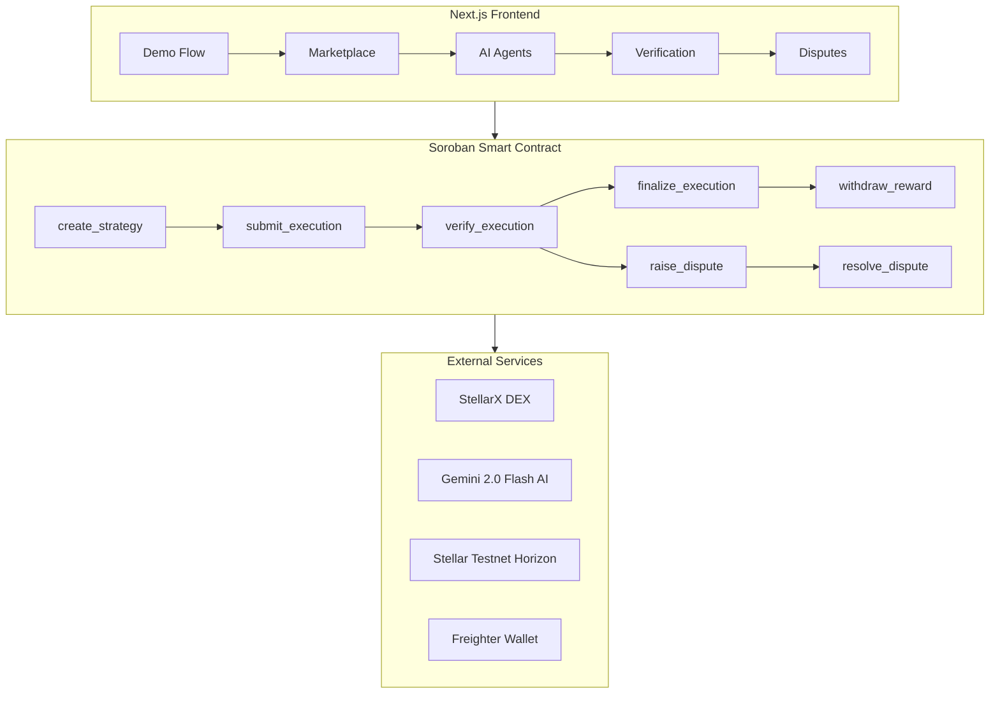
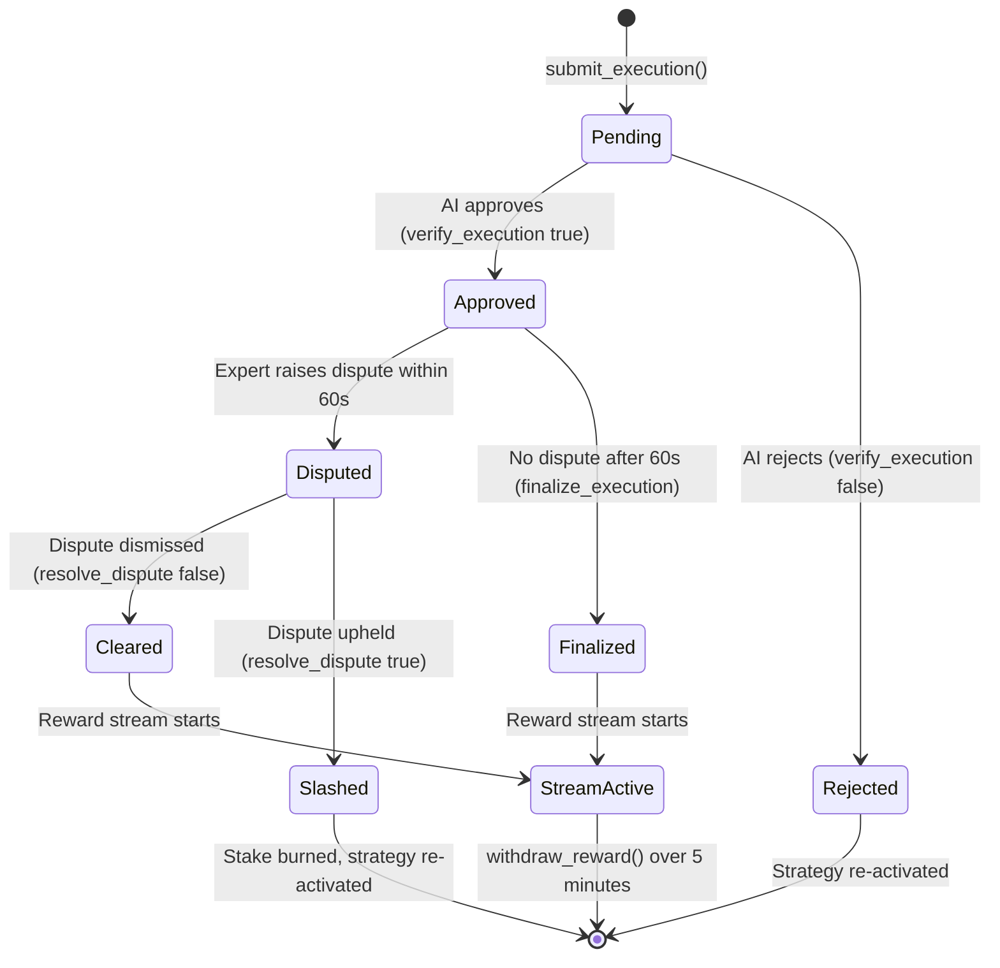
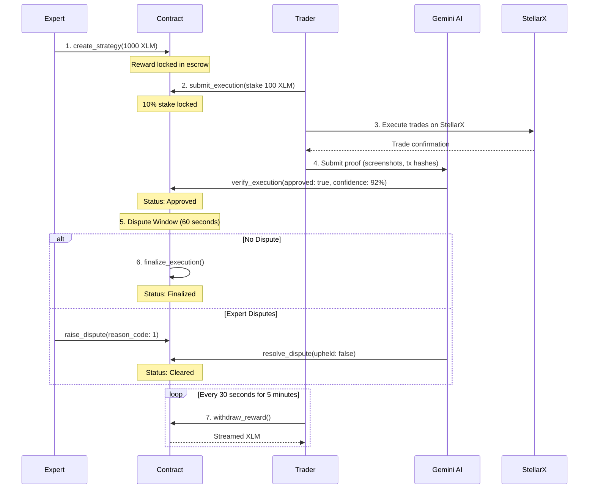

# StratFlow

**AI-Verified Strategy Marketplace on Stellar**

Stellar Build-A-Thon Chennai 2026 | February 7-8, 2026

---

## Table of Contents

- [Overview](#overview)
- [Problem Statement](#problem-statement)
- [Solution](#solution)
- [Architecture](#architecture)
- [Execution Lifecycle](#execution-lifecycle)
- [Key Features](#key-features)
- [Tech Stack](#tech-stack)
- [Project Structure](#project-structure)
- [Smart Contract API](#smart-contract-api)
- [Demo Flow](#demo-flow)
- [Quick Start](#quick-start)
- [Environment Variables](#environment-variables)
- [Testing](#testing)
- [License](#license)

---

## Overview

StratFlow is a decentralized trading strategy marketplace built on Stellar where:

- Experts publish trading strategies and lock XLM rewards as incentive
- Traders execute strategies on StellarX DEX and submit proof
- AI (Gemini 2.0 Flash) verifies execution proofs with confidence scoring
- Smart contracts handle escrow, disputes, and streaming payouts

---

## Problem Statement

Trading strategy experts cannot monetize their knowledge without:
- Managing other people's money (custody risk)
- Building trust with strangers (reputation problem)  
- Handling complex legal/compliance issues

Traders cannot access quality strategies because:
- No way to verify expert track records
- No protection against fake or outdated strategies
- No transparent profit-sharing mechanism

---

## Solution

StratFlow creates a trustless marketplace with perfect incentive alignment:

1. Experts publish strategies and lock reward escrow (skin in the game)
2. Traders stake 10% collateral and execute independently on StellarX
3. AI verifies execution proof against strategy rules
4. Dispute window allows experts to challenge fraudulent claims
5. Streaming payouts distribute rewards over time

**Result:** Experts only earn when traders succeed. Traders only pay on verified success.

---

## Architecture



---

## Execution Lifecycle



---

## Key Features

| Feature | Description |
|---------|-------------|
| Strategy Marketplace | Experts publish strategies with locked XLM rewards |
| Staking Mechanism | Traders stake 10% of reward as collateral |
| AI Agent Execution | Autonomous trading bots execute strategies 24/7 |
| Gemini AI Verification | Analyzes proofs, assigns 0-100 confidence scores |
| Dispute Resolution | 60-second window for experts to challenge |
| Streaming Payouts | Rewards unlock linearly over 5 minutes |
| On-Chain Escrow | All funds locked in Soroban smart contracts |
| StellarX Integration | One-click trading on Stellar native DEX |

---

## Tech Stack

| Layer | Technology |
|-------|------------|
| Blockchain | Stellar Testnet + Soroban Smart Contracts |
| Smart Contract | Rust + soroban-sdk |
| Frontend | Next.js 14, React 18, TypeScript |
| Styling | TailwindCSS, Framer Motion |
| AI Verification | Google Gemini 2.0 Flash API |
| Wallet | Freighter Browser Extension |
| DEX | StellarX Integration |
| Database | SQLite (better-sqlite3) |
| Auth | JWT (jose) + bcrypt |

---

## Project Structure

```
stratflow/
├── contracts/
│   └── stratflow/
│       ├── Cargo.toml
│       └── src/
│           └── lib.rs              # Soroban smart contract (700+ lines)
│
├── frontend/
│   ├── app/
│   │   ├── page.tsx                # Landing page
│   │   ├── login/                  # Authentication
│   │   ├── signup/
│   │   ├── api/
│   │   │   ├── auth/               # Login, signup, session endpoints
│   │   │   ├── oracle/             # Price feed API
│   │   │   └── verify/             # Gemini AI verification endpoint
│   │   └── app/
│   │       ├── page.tsx            # Dashboard overview
│   │       ├── demo/               # 6-step demo walkthrough
│   │       ├── marketplace/        # Browse and stake on strategies
│   │       ├── create/             # Publish new strategies
│   │       ├── agents/             # AI agent dashboard
│   │       ├── verify/             # AI verification results
│   │       ├── submissions/        # View past submissions
│   │       └── dispute/            # Challenge executions
│   │
│   ├── components/
│   │   ├── Navbar.tsx
│   │   ├── Sidebar.tsx
│   │   ├── WalletProvider.tsx
│   │   ├── StellarXIntegration.tsx
│   │   ├── ProofUploader.tsx
│   │   └── LivePriceOracle.tsx
│   │
│   └── lib/
│       ├── stellar.ts              # Stellar SDK helpers
│       ├── contract.ts             # Contract interaction
│       ├── auth.tsx                # Auth context
│       ├── session.ts              # JWT session management
│       └── db.ts                   # SQLite database
│
├── scripts/
│   └── test-flow.md
│
└── README.md
```

---

## Smart Contract API

### Data Structures

| Structure | Fields |
|-----------|--------|
| Strategy | creator, reward_amount, active |
| Execution | executor, strategy_id, verified, status, stake_amount, approved_at, confidence |
| RewardStream | total_amount, start_time, end_time, withdrawn |
| Dispute | challenger, execution_id, reason_code, created_at, resolved, upheld |

### Execution Status Enum

| Status | Description |
|--------|-------------|
| Pending | Submitted, awaiting AI verification |
| Approved | AI approved, in dispute window |
| Disputed | Expert raised a challenge |
| Cleared | Dispute dismissed, stream starts |
| Slashed | Dispute upheld, stake burned |
| Finalized | No dispute, stream starts |
| Rejected | AI rejected outright |

### Write Functions

| Function | Parameters | Returns | Description |
|----------|------------|---------|-------------|
| create_strategy | creator: Address, reward_amount: i128 | u64 | Expert publishes strategy, locks reward in escrow |
| submit_execution | executor: Address, strategy_id: u64 | u64 | Trader stakes 10% and submits execution |
| verify_execution | execution_id: u64, approved: bool | bool | Record AI verdict, enter dispute window if approved |
| set_confidence | execution_id: u64, confidence: u32 | - | Store AI confidence score (0-100) |
| raise_dispute | challenger: Address, execution_id: u64, reason_code: u32 | u64 | Expert challenges within 60s window |
| resolve_dispute | execution_id: u64, upheld: bool | bool | Resolve dispute: slash or clear |
| finalize_execution | execution_id: u64 | bool | No dispute raised, start reward stream |
| withdraw_reward | executor: Address, execution_id: u64, amount: i128 | i128 | Claim streamed rewards |

### Read Functions

| Function | Parameters | Returns | Description |
|----------|------------|---------|-------------|
| get_strategy | strategy_id: u64 | Strategy | Get strategy details |
| get_execution | execution_id: u64 | Execution | Get execution details |
| get_stream | execution_id: u64 | RewardStream | Get reward stream |
| get_dispute | dispute_id: u64 | Dispute | Get dispute record |
| get_exec_dispute | execution_id: u64 | u64 | Get dispute ID for execution |
| get_dispute_window | - | u64 | Returns 60 (seconds) |
| get_min_confidence | - | u32 | Returns 85 (percent) |
| get_earned | execution_id: u64 | i128 | Calculate current earned amount |

### Contract Constants

| Constant | Value | Description |
|----------|-------|-------------|
| DISPUTE_WINDOW | 60 seconds | Time for expert to challenge (demo) |
| MIN_CONFIDENCE | 85% | Minimum AI confidence to approve |
| STAKE_PERCENT | 10% | Executor stake as percentage of reward |
| STREAM_DURATION | 300 seconds | Reward streaming period (5 minutes) |

---

## Demo Flow



### Step-by-Step

1. **Expert Creates Strategy** - Expert locks 1000 XLM reward and publishes trading rules
2. **Trader Stakes** - Trader stakes 100 XLM (10%) as collateral and commits to execute
3. **Execute on StellarX** - Trader executes trades on Stellar DEX following strategy rules
4. **AI Verification** - Gemini 2.0 Flash analyzes proof and assigns confidence score
5. **Dispute Window** - Expert has 60 seconds to challenge the execution
6. **Finalization** - If no dispute, execution is finalized and stream starts
7. **Streaming Payout** - Trader withdraws rewards linearly over 5 minutes

---

## Quick Start

### Prerequisites

- Node.js v18+
- Rust v1.84+ (for contract development)
- Stellar CLI v25+ (for deployment)
- Freighter Wallet browser extension

### Installation

```bash
# Clone repository
git clone https://github.com/your-repo/stratflow
cd stratflow

# Install frontend dependencies
cd frontend
npm install

# Run development server
npm run dev
```

Open http://localhost:3000 and click "Demo Flow" in the sidebar.

### Deploy Smart Contract

```bash
cd contracts

# Add Soroban target
rustup target add wasm32v1-none

# Build contract
cargo build --target wasm32v1-none --release

# Deploy to Stellar Testnet
stellar contract deploy \
  --wasm target/wasm32v1-none/release/stratflow.wasm \
  --source YOUR_SECRET_KEY \
  --network testnet
```

---

## Environment Variables

Create `frontend/.env.local`:

```env
# Gemini AI API Key
GEMINI_API_KEY=your_gemini_api_key

# Deployed Soroban Contract ID
NEXT_PUBLIC_CONTRACT_ID=CBJRILB6ZOEUWJ7Q5WGXL7PZZJDB7M7YUOFCOYAV3QYZYHGLB7FW5Q73

# Stellar Network Configuration
NEXT_PUBLIC_STELLAR_NETWORK=testnet
NEXT_PUBLIC_HORIZON_URL=https://horizon-testnet.stellar.org
NEXT_PUBLIC_SOROBAN_RPC_URL=https://soroban-testnet.stellar.org
```

---

## Testing

### Smart Contract Tests

```bash
cd contracts/stratflow
cargo test
```

8 test cases covering:
- Full flow without dispute
- Dispute upheld (executor slashed)
- Dispute dismissed (stream starts)
- Rejection re-activates strategy
- Late dispute blocked
- Non-creator dispute blocked
- Withdraw before finalize blocked
- Early withdrawal blocked

### Frontend Tests

```bash
cd frontend
node test-demo.mjs
```

---

## Security Model

| Guarantee | Enforcement |
|-----------|-------------|
| No reward without verification | verify_execution must approve first |
| No early withdrawal | Streaming math enforced on-chain |
| No admin override | Zero admin functions in contract |
| Stake prevents fraud | 10% stake slashed if dispute upheld |
| AI cannot move funds | AI returns verdict only, contract handles payouts |
| Dispute protection | 60-second challenge window before finalization |

---

## Hackathon Submission

| Field | Value |
|-------|-------|
| Event | Stellar Build-A-Thon Chennai |
| Date | February 7-8, 2026 |
| Prize Pool | $1,200 |
| Track | DeFi / AI / Payments |

---

## License

MIT License

---

Built for Stellar Build-A-Thon Chennai 2026
